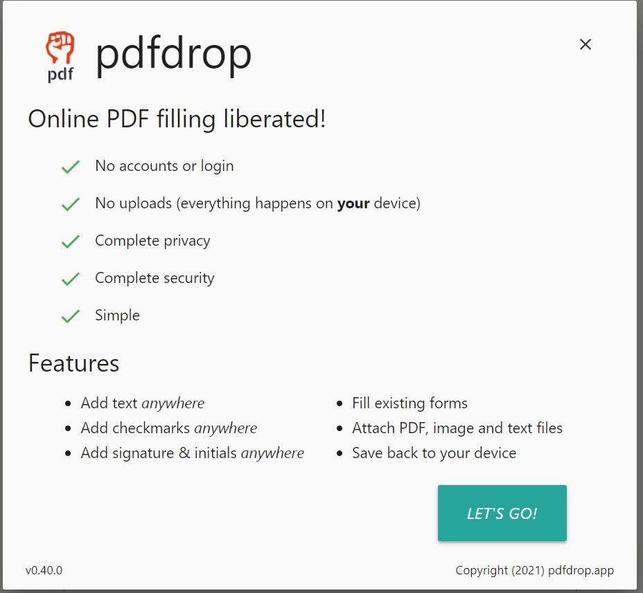

# pdfdrop.app

A repository for issues and feedback for https://pdfdrop.app.

## Toolchain
pdfdrop.app is made with these fine open source technologies:
- [PDF.js](https://github.com/mozilla/pdf.js) for the viewer
- [pdf-lib](https://github.com/Hopding/pdf-lib) for adding content
- [materialize](https://github.com/Dogfalo/materialize) CSS & components
- [interactjs](https://github.com/taye/interact.js) drag & drop
- [filesize](https://github.com/avoidwork/filesize.js) human-readble size 
- [mousetrap](https://github.com/ccampbell/mousetrap) shortcut handling
- [download](https://github.com/rndme/download) downloading edited file
- [Material design icons](https://github.com/google/material-design-icons)
- [Reenie Beanie](https://fonts.google.com/specimen/Reenie+Beanie) signature font
- [workbox](https://github.com/GoogleChrome/workbox) Service worker and offline usage

## Other online PDF solutions
These services require various combinations of:

    - paid service
    - account creation (even for free use)
    - limited free usage
    - upload your file to their servers

- [PDFBuddy](https://www.pdfbuddy.com/) (clean interface, requires account to save/download)
- [Sedja PDF editor](https://www.sejda.com/pdf-editor) (feature rich, limited free usage)
- [pdfFiller](https://www.pdffiller.com/) (feature rich editing, requires account to save or print)
- [FillAnyPDF](https://www.fillanypdf.com/) (dated interface, requires account)
- [PDF Otter](https://www.pdfotter.com/fill-in-pdf-for-free) (Editor only supports adding text.  API is available.)
- [smallpdf](https://smallpdf.com/) (requires account to try)

Not quite related to online PDF filling, but interesting:
- [Paperplane](https://www.paperplane.app/) API to convert HTML pages to PDF (using [Puppeteer](https://github.com/puppeteer/puppeteer))
- [weasyprint](https://weasyprint.org/) "It turns simple HTML pages into gorgeous..." PDFs
